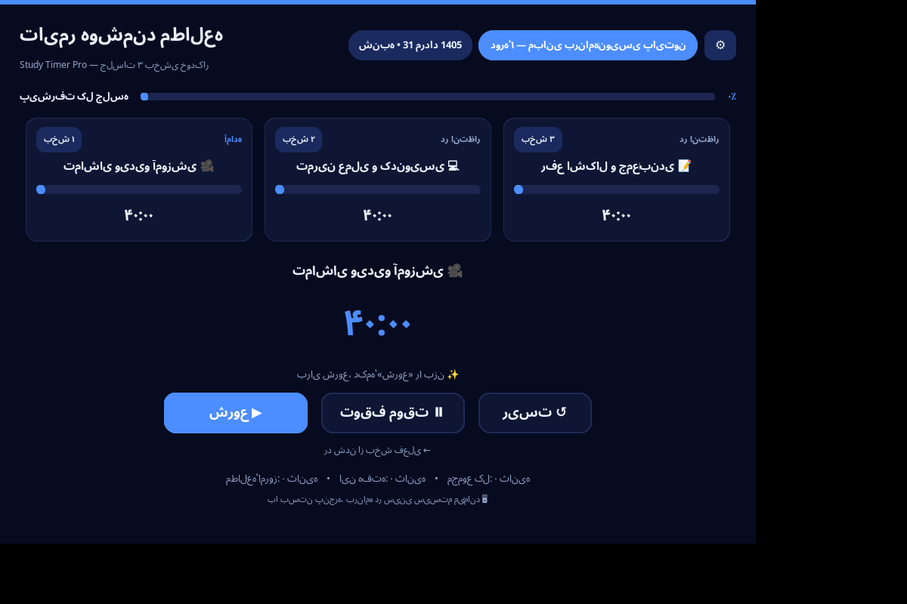
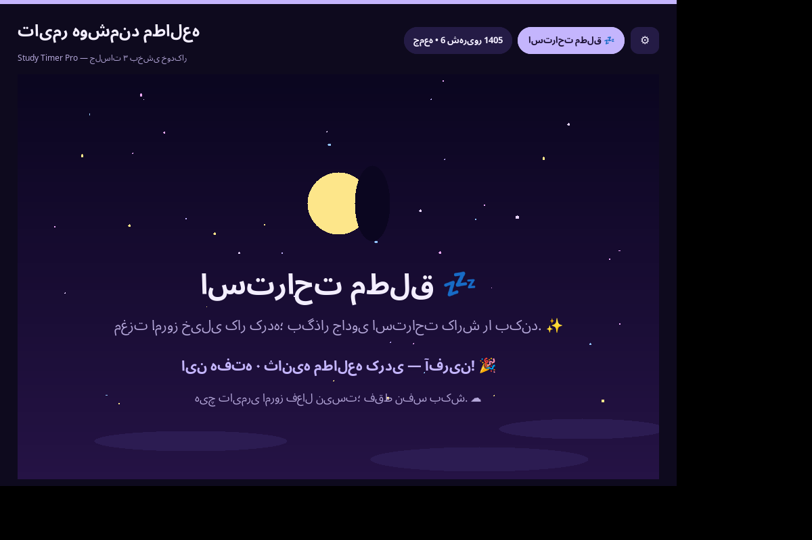

# ⏱️ Study Timer Pro — تایمر هوشمند مطالعه

یک اپلیکیشن دسکتاپ **گرافیکی، دارک‌مود و لوکس** با پایتون و **CustomTkinter** که کاملاً بدون
ارتباط با پنجرهٔ CMD اجرا می‌شود و جلسات مطالعه را به‌صورت **۳ بخشِ خودکارِ ۴۰ دقیقه‌ای**
(مجموعاً ۱۲۰ دقیقه) با **اعلان صوتی مردانه**، **تم رنگی داینامیکِ هر دوره** و **چرخش هوشمند
روزهای هفته** مدیریت می‌کند.

> [!NOTE]
> هر جلسهٔ استاندارد = ۳ بخش × ۴۰ دقیقه = **۱۲۰ دقیقه = ۷۲۰۰ ثانیه**.
> (عدد «۱۲۰۰۰» در درخواست اولیه معادل ۲۰۰ دقیقه است، نه ۱۲۰ دقیقه؛ بنابراین مقدار صحیح
> ۷۲۰۰ ثانیه به‌کار رفته. اگر مدت‌زمان دلخواه دیگری می‌خواهید، از `config.py` تغییر دهید.)

---

## ✨ امکانات کلیدی

| # | ویژگی | توضیح |
|---|-------|-------|
| ۱ | **ساختار زمانی ۳ بخشی** | «تماشای ویدیو آموزشی 🎥» → «تمرین عملی و کدنویسی 💻» → «رفع اشکال و جمع‌بندی 📝» — هر کدام ۴۰ دقیقه، با نوار پیشرفت اختصاصی و اجرای **خودکار و پیاپی** |
| ۲ | **اعلان صوتی مردانه** | پایان هر بخش با صدای مردانهٔ سیستم (pyttsx3/SAPI5) پیام می‌گوید: «وقت ویدیو تمام شد، برید سراغ تمرین!» — با پشتیبانی از فایل‌های MP3 و زنگ پیش‌فرض به‌عنوان جایگزین |
| ۳ | **تم رنگی داینامیک** | هر دوره/روز پالت اختصاصی دارد؛ با تغییر روز، کل داشبورد (پس‌زمینه، دکمه‌ها، نوارها، چیپ‌ها) به رنگ آن دوره درمی‌آید |
| ۴ | **چرخش هوشمند هفته** | شنبه–سه‌شنبه: دورهٔ ۱ تا ۴ • چهارشنبه: مرور هفتگی • پنجشنبه: پروژهٔ عملی • جمعه: استراحت مطلق با انیمیشن آرامش‌بخش |
| ۵ | **دکمه‌های بزرگ هاوردار** | شروع ▶ / توقف موقت ⏸ / ریست ↺ + دکمهٔ رد شدن از بخش |
| ۶ | **سینی سیستم (System Tray)** | با بستن پنجره، برنامه به سینی ویندوز می‌رود و تسک‌بار را اشغال نمی‌کند |
| ۷ | **تاریخچهٔ خودکار JSON** | اتمام هر بخش بلافاصله در `history.json` ثبت می‌شود (امروز / این هفته / مجموع کل) |
| ۸ | **تاریخ شمسی** | نمایش روز و تاریخ شمسی (مثلاً «شنبه • ۲۹ مرداد ۱۴۰۵») با الگوریتم تبدیل میلادی→شمسی |
| ۹ | **تنظیمات صدا** | پنجرهٔ تنظیمات: صدای مردانه / فایل MP3 / زنگ / بی‌صدا + اسلایدر حجم |

---

## 🎨 تم‌های رنگی دوره‌ها

| روز | حالت | نام تم | رنگ اصلی |
|-----|------|--------|----------|
| شنبه | دورهٔ ۱ — مبانی پایتون | **آبی کهکشانی** 🌌 | `#4C8DFF` |
| یکشنبه | دورهٔ ۲ — پایتون پیشرفته | **سبز مدرن** 🌿 | `#2FD18A` |
| دوشنبه | دورهٔ ۳ — دیتابیس و بک‌اند | **کهربایی طلایی** 🏺 | `#F5A524` |
| سه‌شنبه | دورهٔ ۴ — هوش مصنوعی | **بنفش نئونی** 🟣 | `#A855F7` |
| چهارشنبه | مرور و بازنگری هفتگی | **فیروزه‌ای** 💠 | `#2DD4BF` |
| پنجشنبه | پروژهٔ عملی و رفع اشکال | **سرخ آتشی** 🔥 | `#F06A5A` |
| جمعه | استراحت مطلق | **بنفش رویایی** 🌙 | `#C4B5FD` |

---

## 📁 ساختار فایل‌ها

```
study-timer/
├── main.py            ← نقطهٔ ورود برنامه (اجرا از همین‌جا)
├── app.py             ← رابط کاربری گرافیکی اصلی (CustomTkinter)
├── config.py          ← مدت‌زمان‌ها، برنامهٔ هفتگی، عبارات صوتی، تاریخ شمسی
├── themes.py          ← پالت‌های رنگی لوکسِ دوره‌ها
├── voice.py           ← موتور صدای مردانه + fallback (TTS / MP3 / زنگ)
├── tray.py            ← آیکون سینی سیستم ویندوز
├── history.py         ← ذخیرهٔ خودکار تاریخچه در JSON
├── tests.py           ← ۴۸ تست خودکار منطق برنامه
├── requirements.txt   ← پکیج‌های موردنیاز
├── run.bat            ← اجرا بدون پنجرهٔ CMD (pythonw)
├── build_exe.bat      ← ساخت فایل exe مستقل
├── sounds/            ← (اختیاری) فایل‌های صوتی: block_end.mp3 و…
└── history.json       ← به‌صورت خودکار ساخته می‌شود
```

---

## 🚀 نصب و اجرا

### ۱) نصب پایتون
از [python.org](https://www.python.org) پایتون ۳.۱۰ به‌بالا را نصب کنید
(در نصب‌کنندهٔ ویندوز حتماً تیک **Add Python to PATH** را بزنید).

### ۲) نصب پکیج‌ها
در پوشهٔ پروژه (جایی که `requirements.txt` هست) یک بار اجرا کنید:

```bash
pip install -r requirements.txt
```

یا دستی:

```bash
pip install customtkinter pystray Pillow pyttsx3
# اختیاری (فقط برای پخش فایل‌های MP3):
pip install playsound
```

### ۳) اجرای برنامه

**روش معمول (CMD):**
```bash
python main.py
```

**بدون هیچ پنجرهٔ CMD (فقط پنجرهٔ گرافیکی):**
- روی `run.bat` دوبار کلیک کنید (از `pythonw` استفاده می‌کند)، یا:
- در CMD تایپ کنید: `pythonw main.py`

### ۴) (اختیاری) ساخت فایل اجرایی مستقل
دوبار کلیک روی `build_exe.bat` → خروجی: `dist\StudyTimerPro.exe`
(با `pyinstaller --windowed` ساخته می‌شود؛ بدون CMD، بدون نیاز به نصب پایتون روی سیستم مقصد).

---

## 🗣️ تنظیم صدای مردانه

برنامه با `pyttsx3` (موتور SAPI5 ویندوز) کار می‌کند و به‌صورت خودکار **مردانه‌ترین صدای
موجود** را انتخاب می‌کند (مثل *Microsoft David*).

- اگر روی ویندوز صدای **فارسی** نصب باشد، پیام‌ها فارسی پخش می‌شوند.
- اگر صدای فارسی نباشد، پیامِ **معادلِ انگلیسی** با همان صدای مردانه خوانده می‌شود.
- برای پیام فارسیِ قطعی: می‌توانید صدای فارسی SAPI5 نصب کنید، یا فایل‌های صوتی خود را در
  پوشهٔ `sounds/` با این نام‌ها بگذارید و در تنظیمات، حالت «پخش فایل صوتی» را انتخاب کنید:

| نام فایل | رویداد |
|----------|--------|
| `session_start.mp3` | شروع جلسه |
| `block_end.mp3` | پایان هر بخش |
| `session_complete.mp3` | پایان کامل جلسه |

> اگر هیچ‌کدام در دسترس نباشد، **زنگ پیش‌فرض ویندوز** پخش می‌شود تا اعلان هرگز بی‌صدا نماند.

---

## ⚙️ شخصی‌سازی

### تغییر مدت‌زمان بخش‌ها
در `config.py`:
```python
VIDEO_MIN = 40      # بخش اول
PRACTICE_MIN = 40   # بخش دوم
DEBUG_MIN = 40      # بخش سوم
```

### تغییر نام دوره‌ها / برنامهٔ هفتگی
در `config.py` بخش `COURSE_NAMES` و `SCHEDULE` را ویرایش کنید.

### حالت تست سریع (برای توسعه)
بخش‌ها را ۲ ثانیه‌ای می‌کند تا کل چرخه را سریع ببینید:
```bash
set STUDY_TIMER_FAST=1 && python main.py
```

---

## 🖱️ راهنمای استفاده

1. برنامه بر اساس روزِ هفته، خودش حالت درست را لود می‌کند (دوره / مرور / پروژه / استراحت).
2. روی **شروع ▶** بزنید — تایمر بخش اول (ویدیو) شروع می‌شود و در پایان هر بخش صدا اعلام
   می‌کند و **به‌صورت خودکار** بخش بعدی آغاز می‌شود.
3. **توقف موقت ⏸** / **ادامه ▶** و **ریست ↺** برای کنترل دستی؛ «رد شدن از بخش» هم برای
   جلو افتادن از بخش فعلی است.
4. با بستن پنجره، برنامه به **سینی سیستم** می‌رود (روی آیکون راست‌کلیک کنید: نمایش پنجره /
   شروع / توقف-ادامه / خروج).
5. دکمهٔ ⚙ تنظیمات: حالت صدا و حجم.

میان‌برهای کیبورد: **Space** = شروع/توقف • **R** = ریست

---

## 📊 فایل تاریخچه (history.json)

با اتمام هر بخش به‌صورت خودکار ذخیره می‌شود:

```json
{
  "days": {
    "2026-08-22": {
      "date": "2026-08-22",
      "day_index": 0,
      "day_name": "شنبه",
      "title": "دورهٔ ۱ — مبانی برنامه‌نویسی پایتون",
      "blocks_completed": 3,
      "block_labels": ["تماشای ویدیو آموزشی 🎥", "…"],
      "study_seconds": 7200,
      "events": [ {"ts": "…", "type": "block_completed", "label": "…", "seconds": 2400} ]
    }
  },
  "total_seconds": 7200
}
```

در پایین داشبورد، آمار «امروز / این هفته / مجموع کل» همیشه به‌روز نشان داده می‌شود.

---

## 🧪 تست‌ها

```bash
python tests.py
```
۴۸ تست خودکار (تاریخ شمسی، چرخش هفته، مدت‌زمان‌ها، پالت‌ها، تاریخچهٔ JSON، عبارات صوتی) —
نتیجهٔ فعلی: **۴۸ موفق / ۰ ناموفق**.

---

## 🛠️ عیب‌یابی

| مشکل | راه‌حل |
|------|--------|
| `pyttsx3` صدا ندارد | صدای ویندوز را چک کنید؛ یا حالت صدا را از ⚙ روی «زنگ ساده» یا «MP3» ببرید. اگر پیام انگلیسی شنیده می‌شود یعنی صدای فارسی SAPI5 نصب نیست (طبیعی است). |
| سینی سیستم ظاهر نمی‌شود | `pip install pystray Pillow` را نصب کنید؛ اگر باز نشد، بستن پنجره = خروج کامل (برنامه خراب نمی‌شود). |
| فونت فارسی ناخوانا | برنامه فونت فارسی‌پشتیبان را خودکار انتخاب می‌کند (Segoe UI / Tahoma). در ویندوز ۱۰+ بدون مشکل است. |
| خطاها کجا ثبت می‌شوند؟ | فایل `app.log` کنار برنامه. |

---

## 📸 اسکرین‌شات‌ها

پیش‌نمایش‌های واقعی اجرای برنامه (پوشهٔ `shots/`):

| شنبه — دورهٔ ۱ (آبی کهکشانی) | جمعه — استراحت مطلق (انیمیشن) |
|---|---|
|  |  |

*نکته: ایموجی‌ها و فونت‌ها در ویندوز کامل‌تر از محیط لینوکسی که اسکرین‌شات از آن گرفته شده است رندر می‌شوند.*

---

ساخته‌شده با ❤️ و CustomTkinter — موفق باشید! 🚀
